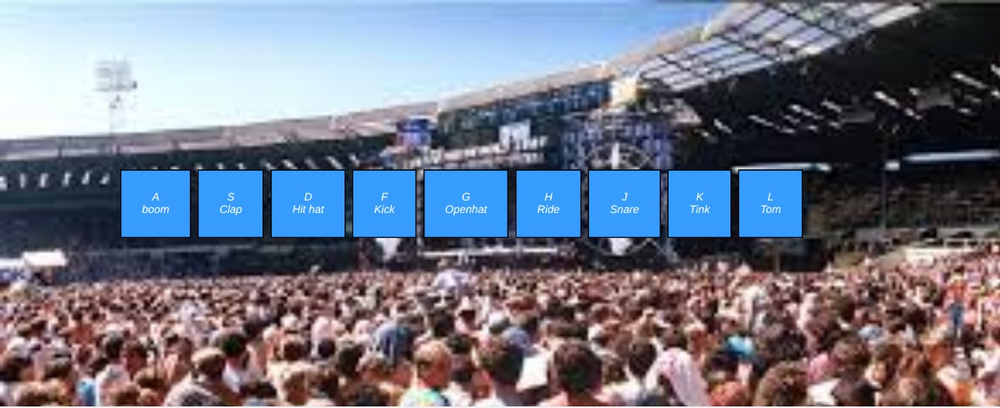

# Preview

# Project Name
Drums

> Description the project.
A simple project where one on a click to a particular key plays a particular sound

## Built With

- HTML5, CSS3, JavaScript

## Live Demo (if available)

[Live Demo Link](https://livedemo.com)

## Authors

👤 **Author1**

- GitHub: [@githubhandle](https://github.com/tingamapuro04)
- LinkedIn: [LinkedIn](https://www.linkedin.com/in/adoyo-alphonce/)

## Show your support

Give a ⭐️ if you like this project!

## Acknowledgments

- Hat tip to anyone whose code was used
- Inspiration
- etc

## 📝 License

This project is [MIT](./LICENSE) licensed.

_NOTE: we recommend using the [MIT license](https://choosealicense.com/licenses/mit/) - you can set it up quickly by [using templates available on GitHub](https://docs.github.com/en/communities/setting-up-your-project-for-healthy-contributions/adding-a-license-to-a-repository). You can also use [any other license](https://choosealicense.com/licenses/) if you wish._
